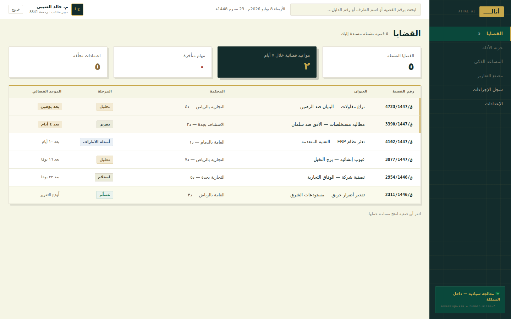
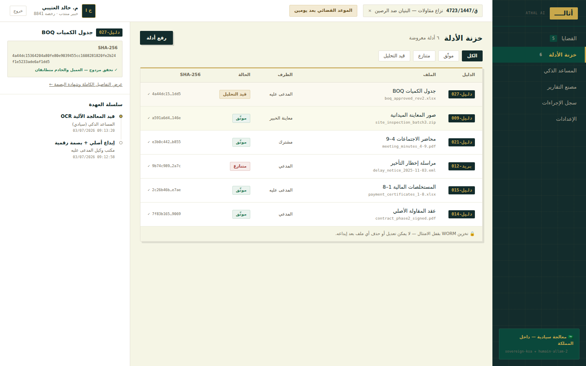
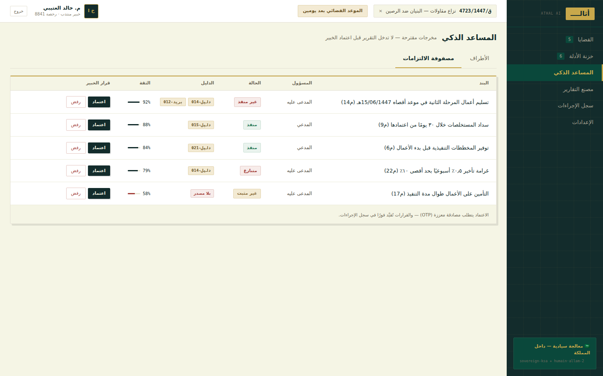
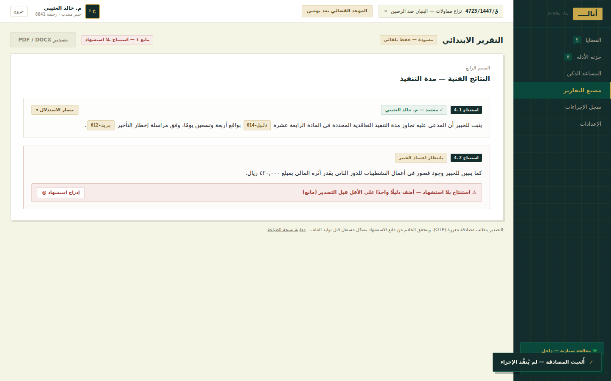

# أثال — منصة الخبرة القضائية الذكية (Athal AI Workspace)

**الذكاء يقترح، والخبير يعتمد.**

Athal is a sovereign, Arabic-first, RTL SaaS workspace for court-appointed judicial experts (خبراء قضائيون) in Saudi Arabia. It turns case evidence into a court-defensible report: every conclusion is backed by numbered, hash-verified evidence, and every AI suggestion, approval, rejection, and export is written to an immutable, hash-chained audit trail.

Built from the design handoff in `Khibrah_AI_Workspace.zip` (high-fidelity HTML prototypes + spec).

## Stack

- **Next.js 15** (App Router) + React 19 + TypeScript
- **Tailwind CSS v4** with the design-token palette (ink `#132C2C` / paper `#F5F5E5` / gold `#C8A84B`, 2px radii, hard offset shadows)
- **SQLite** (better-sqlite3) — auto-creates schema and seeds demo data on first run
- **jose** (JWT) for sessions and single-use step-up tokens
- Fonts: IBM Plex Sans Arabic + IBM Plex Mono (mono fields render LTR even inside RTL prose)

## Run

```bash
npm install
npm run dev        # http://localhost:3000
npm run db:reset   # wipe the local demo database (re-seeds on next start)
```

**Demo accounts** (password for all: `Athal!Demo1447`):

| البريد | الدور |
| --- | --- |
| `khalid@athal.sa` | الممثل النظامي — خبير منتدب |
| `sara@athal.sa` | مستخدم قياسي — أمينة السر |
| `fahad@athal.sa` | مدير قسم — خبير محاسبي |
| `noura@athal.sa` | قراءة فقط |

Sign-in is two-factor by design (password → mandatory OTP). **Demo mode:** there is no SMS integration yet, so the OTP is returned by the API and displayed on-screen as "وضع العرض التوضيحي" — replace with a real delivery channel before production.

## What's implemented

### Screens
- **Landing page** — defensibility promise, pillars, workflow, sovereignty band
- **Sign in** — password + mandatory OTP step (Nafath button reserved, disabled)
- **القضايا** — stat tiles + case table with stage chips and court-deadline countdowns
- **خزنة الأدلة** — evidence table with filters, SHA-256 hashes, WORM notice, and a chain-of-custody detail rail
- **رفع أدلة** — drag-and-drop batch upload: client-side SHA-256 hashing, per-file metadata gate, mandatory authenticity acknowledgment, irreversible deposit
- **تفاصيل الدليل** — full hash, metadata, linked conclusions, full custody chain with per-event hashes
- **المساعد الذكي** — parties + obligations matrix; approve (OTP-gated) / reject / undo, confidence bars, evidence-reference jump links, "بلا مصدر" warnings
- **مصنع التقارير** — numbered conclusions with inline citation chips, expandable reasoning trace (مسار الاستدلال), citation blockers, OTP-gated export, print view with auto-generated appendices (evidence list + سجل أعمال الخبير)
- **سجل الإجراءات** — read-only hash-chained log with live chain-integrity check
- **الإعدادات** — profile / team / AI providers (sovereign default locked on, HUMAIN toggle) / security
- **إدارة المستخدمين** — users + pending invitations, invite drawer (external consultants require an expiry date), suspend/reactivate

### Server-enforced guardrails (not just UI)
1. **Step-up authentication** — every approval/export requires a fresh OTP challenge; the server issues a short-lived **single-use** signed token and independently re-verifies + consumes it inside the critical-action endpoint. 3 failed attempts lock the challenge and write a security audit entry.
2. **Citation gate** — `POST /api/cases/:id/report/export` re-validates that zero conclusions are uncited before allowing export (HTTP 409 otherwise), regardless of client state.
3. **Double hash verification** — evidence deposit recomputes SHA-256 server-side and rejects mismatches with «بصمة الخادم لا تطابق بصمة العميل — لم يُودَع الملف» (also audited).
4. **Malware gate** — uploads are scanned before deposit (simulated dual-engine; EICAR signature detection). Infected files are quarantined — never deposited, never deleted.
5. **WORM / append-only** — evidence rows are never updated or deleted; custody events and audit entries are append-only and hash-chained (`eventHash = H(prevEventHash + payload)`), with chain verification surfaced in the log screen.
6. **Tenant isolation** — every query is scoped to the session's tenant.
7. **Role guards** — read-only/consultant roles cannot take decisions; admin endpoints require الممثل النظامي; the sole active systemic rep can never be suspended.

## Structure

```
src/
  app/                  # routes: / (landing), /login, /app/** (workspace), /api/**
  components/           # design-system primitives, StepUpModal, Sidebar, Topbar, Toast
  db/                   # SQLite schema (DDL), open/seed logic, demo seed data
  lib/                  # sessions, step-up service, hash-chain audit, status maps, formatting
middleware.ts           # /app/** requires a session
```

The demo database and uploaded evidence blobs live in `.data/` (gitignored).

## Screenshots

| | |
| --- | --- |
|  |  |
|  |  |

## Not yet implemented (from the handoff spec)

Case intake wizard (S3), mandate analysis (S4), fee estimator (S5), evidence versioning/redaction UI, security-alerts dashboard (5b), watermarked viewer (5c), incident banner (8d), PDPL requests (8e), API keys (8f), platform-admin tenant switch (8g), expert accreditation module (9a–9c), firm dashboard (4c), scale variants (virtualized vault, grouped obligations), and real integrations (SMS/OTP delivery, actual AI providers, real AV engines, server-generated PDF/DOCX). The OTP flow, retention policies, and audit model should be validated against real PDPL/NCA requirements before launch.
